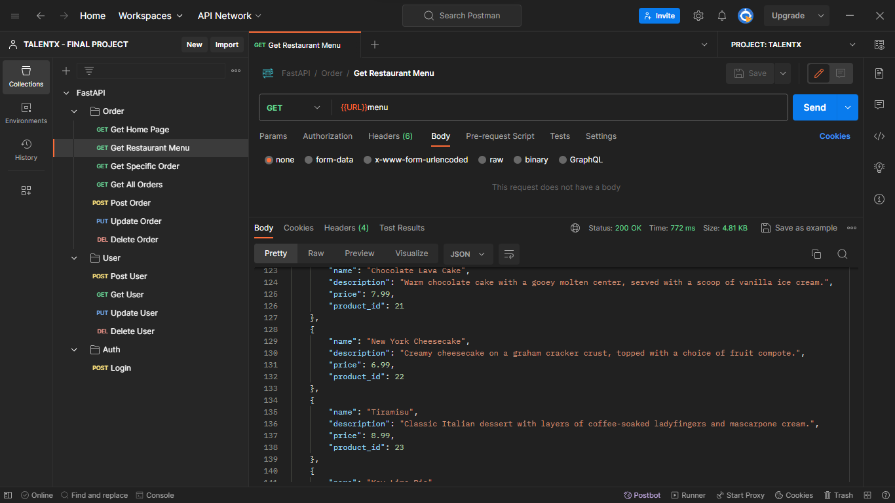
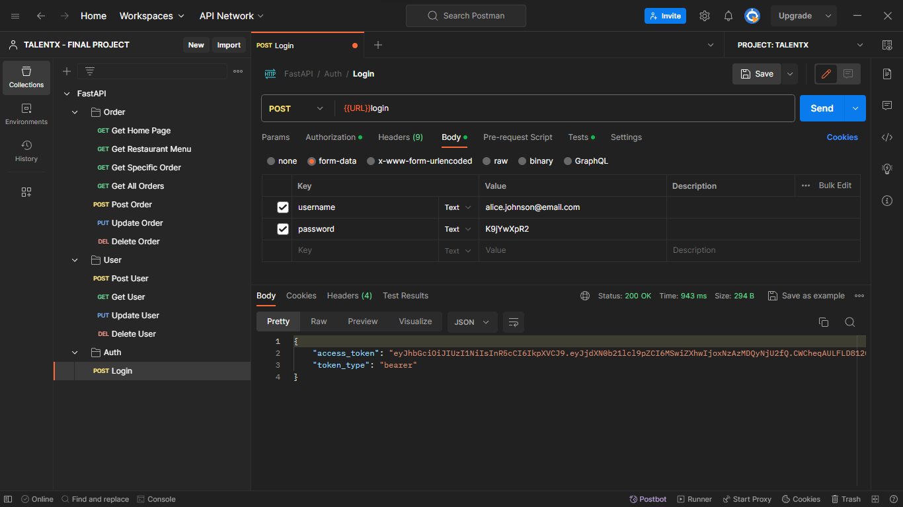
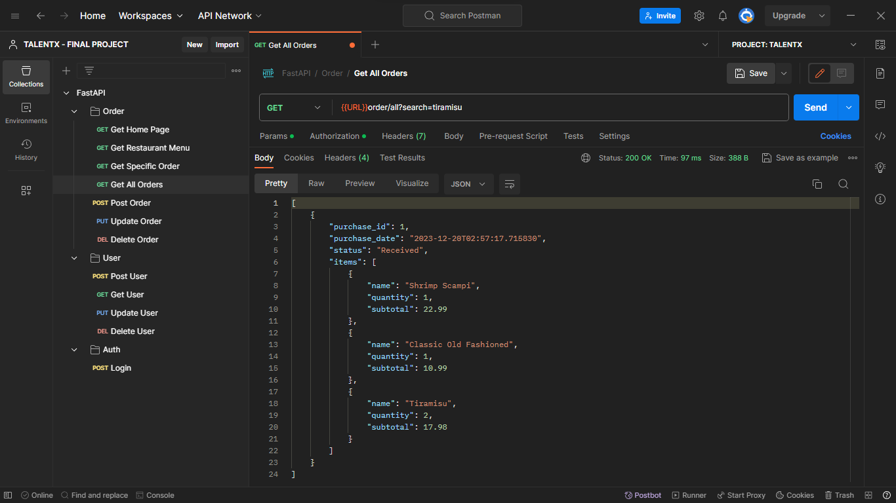

<h1 align="center">

<a href="https://talentx.com.br/">TALENTX</a>
<p>FINAL PROJECT</p>
</h1>

## Index

- <a href="#technologies-used"> Technologies Used </a>
- <a href="#status"> Status </a>
- <a href="#about"> About </a>
- <a href="#project-features"> Project Features </a>
- <a href="#improvements-in-development"> Improvements In Development </a>
- <a href="#demonstration"> Demonstration </a>
- <a href="#how-to-run-the-application"> How To Run The Application </a>
- <a href="#author-person"> Author Person </a>

## Status

- ⚠️ Developing

## About

- An API for restaurants that want to implement delivery
- Allows user registration
- Contains login area
- Access to the restaurant menu
- Sending orders


## Project Features

- [x] User Registration
- [x] Update/Delete User Registration
- [x] Login
- [x] Restaurant Menu
- [x] Request Delivery
- [x] Update/Delete Delivery

## Improvements In Development

- [ ] Payment System
- [ ] Application Front End
- [ ] Shopping Cart System

## Demonstration

### Request Menu

### Log Into

### Request User Data

### Request Order Data


## Technologies Used

<table>
  <tr>
    <td>Python</td>
    <td>PostgreSQL</td>
    <td>Docker</td>
    <td>FastAPI</td>
  </tr>
  <tr>
    <td>3.12.0</td>
    <td>16.1</td>
    <td>24.0.6</td>
    <td>0.104.1</td>
  </tr>
</table>

## How To Run The Application

```bash
# Start application containers
$ docker-compose up
```

## Author Person


